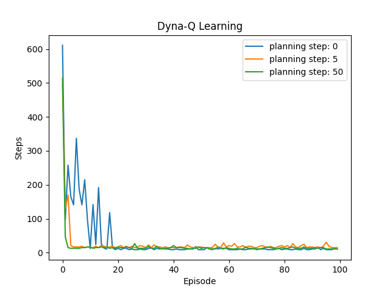
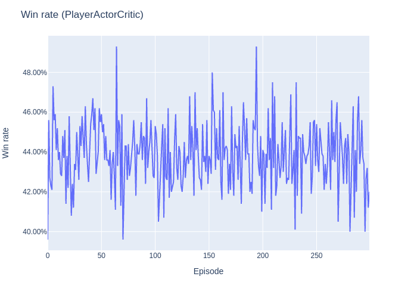

# Reinforcement Learning

## Exercise 2
Multi-armed Bandit

## Exercise 3
Policy Iteration, Value Iteration

## Exercise 4
Monte Carlo, SARSA, Q-Learning, Double Q-Learning

## Exercise 8
Dyna-Q

# Exercise 9
Actor-Critic
